# 1- UBUNTU

## 1.1- Introdução ao WSL

Para utilizar uma distribuição Linux e executar seus binários e scripts no Windows, foi criada a ferramenta WSL *(Windows Subsystem for Linux)* pela Microsoft. Tal ferramenta auxilia desenvolvedores que desejam trabalhar com as ferramentas Linux mantendo seu desktop com o Windows padrão sem a necessidade de Dual Boot ou utilização de Maquinas virtuais (VMs). Para a instalação, a Microsoft apresenta todo o passo a passo documentado em[ https://learn.microsoft.com/pt-br/windows/wsl/install](https://learn.microsoft.com/pt-br/windows/wsl/install).

## 1.2- Atualização do WSL

Primeiramente, deve-se atualizar o kernel do Linux para WSL, instalando o seguinte pacote:[ https://wslstorestorage.blob.core.windows.net/wslblob/wsl_update_x64.msi](https://wslstorestorage.blob.core.windows.net/wslblob/wsl_update_x64.msi). Após a instalação, deve-se garantir que o wsl esteja atualizado. Para isso abre-se o PowerShell do Windows como administrador:

 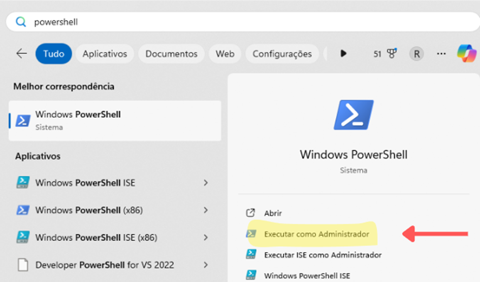 

Com o PowerShell aberto, utiliza-se o comando

~~~bash
wsl --update
~~~

 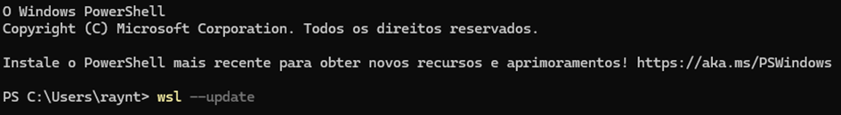 

## 1.3- Instalação do UBUNTU no WSL

Após a atualização, instala-se o Linux na versão desejada com o comando:

~~~bash
wsl --install -d <distroName>
~~~

Onde no lugar de <distroName> deve-se inserir uma das opções fornecidas:

 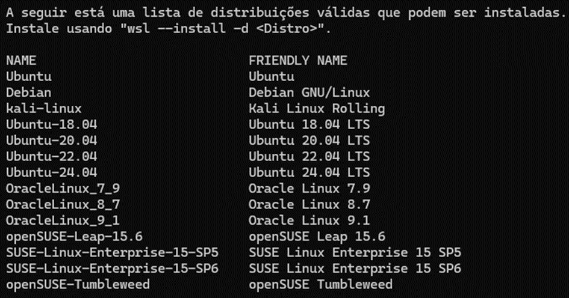 

Como deseja-se instalar o Ubuntu-22.04, utiliza-se

~~~bash
wsl --install -d Ubuntu-22.04
~~~

 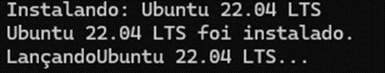 

Assim que concluir a instalação, deve-se reiniciar o computador e o Ubuntu estará pronto para a utilização.

 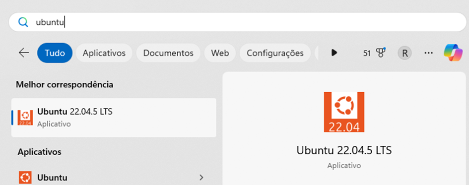 

## 1.4- Configuração do UBUNTU no WSL

Ao abrir, começa o processo de criação do ambiente de trabalho, onde deve-se informar o nome de usuário padrão e senha para que assim seja criado e o Linux esteja pronto para uso.

 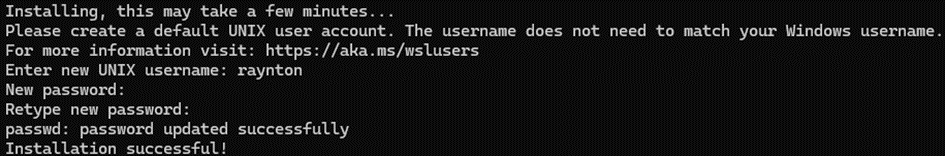 

Para ter acesso root, utiliza-se o comando **sudo su**, desta forma o usuário passa a ter os privilégios de super user.

 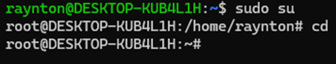 

# 2- NGINX

## 2.1- Instalação do NGINX

Para a instalação do **NGINX**, pode-se seguir a documentação fornecida em <https://ubuntu.com/tutorials/install-and-configure-nginx#2-installing-nginx>, inicialmente se faz o update dos pacotes com o comando:

~~~bash
apt-get update
~~~

Depois realiza-se a instalação do nginx com o comando:

~~~bash
apt-get install nginx
~~~

Após a instalação, o nginx estará funcionando, basta entrar em um navegador e abrir o **localhost** que apresentará a seguinte tela

 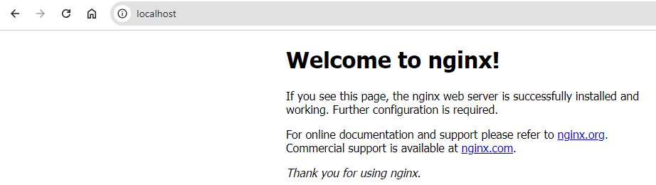 

## 2.2- Configurações do NGINX

Com o nginx funcionando, alguns diretórios são importantes para seu funcionamento. primeiramente seu arquivo de configuração está em **/etc/nginx/sites-enabled/default** indicando a porta em que será ouvido, qual a pasta raíz dos arquivos e qual a ordem de nomes para o arquivo a ser lido. 

~~~bash
server {
	listen 80 default\_server;
	listen [::]:80 default\_server;
	root /var/www/html;

	index index.html index.htm index.nginx-debian.html;

	server\_name \_;

	location / {

	}

}
~~~

Este arquivo será importante para informar o arquivo html a ser lido por padrão. Outro diretório importante está em **/var/www/html**, informado como root. Neste diretório deverá estar a página a ser apresentada pelo nginx. Para a leitura da página, o arquivo a ser aberto seguirá a ordem informada **index index.html index.htm index.nginx-debian.html**, onde inicialmente procura um arquivo **index,** caso exista, ele é aberto, caso não, se procura um arquivo **index.html** e assim sucessivamente nessa lista.

# 3- Script

## 3.1- Captura das informações necessárias

Antes de escrever o script, é importante verificar onde serão colhidas as informações necessárias. Para observar o status do serviço nginx, utiliza-se o comando:

~~~bash
systemctl status nginx
~~~

 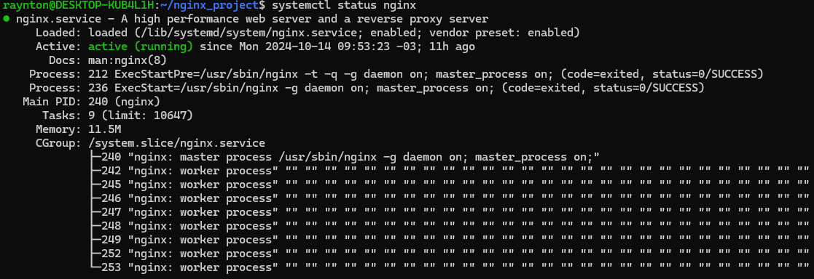 

Como pode-se notar que na seção **Active:** é apresentado o status do serviço, com ajuda do comando grep, é possível ter apenas a informação da linha Active.

~~~bash
systemctl status nginx | grep -i "active"
~~~

 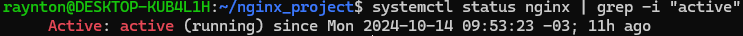 

Para o nome do usuário que está realizando a tarefa, utiliza-se o whoami, que informa o usuário atual no sistema:

 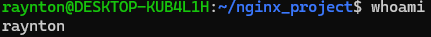 

Para as informações de data e hora, é possível a utilização de vários caminhos distintos, neste script será utilizado a partir do **uptime**. O uptime retorna dados de hora e de acesso:

 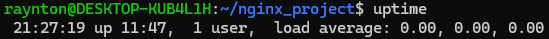 

O horário está sempre antes da palavra **up**, portanto, pode-se utilizar o comando sed, que tem a função de trocar um texto por outro em uma string. Neste caso, deseja-se trocar o trecho **"up 11:47, 1 user, load average: 0.00, 0.00, 0.00"** por um trecho vazio **“”**, resultando em **“21:27:19 ”**. Como esse texto pode mudar com o tempo, pode-se dizer que se deseja trocar tudo após o u **“u.\*”** por vazio. A nomenclatura se da como: 

~~~bash
sed ‘s/ TextoAntes / TextoDepois /’
~~~

 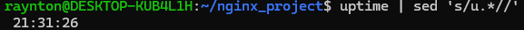 

## 3.2- Criação do script

Cria-se uma nova pasta para o projeto e nessa pasta cria-se o script:

~~~bash
mkdir nginx\_project
touch scriptNginx.sh
~~~

Com o auxílio do VIM, edita-se o arquivo iniciando com #!/bin/bash indicando que este é um script bash.

A variável STATUS recebe a informação do status do NGINX e para uma melhor leitura de sua informação, desejou-se ter todo o texto após os **“: ”** e antes do **“)”**, para isso, utilizou-se das ferramentas de manipulação de texto do bash, o # pega todo o texto após uma informação e o % pega todo o texto antes de uma informação.

 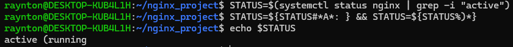 

Adiciona-se um “)” ao final para a informação ficar completa. O nome e a hora podem ser utilizados da mesma forma que chega ao script.

 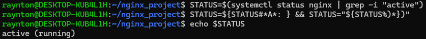 

## 3.3- Alteração da mensagem de status

Para alteração da mensagem, trazendo assim uma informação personalizada e em português, utilizou-se de uma estrutura condicional, caso o status seja “active (running)” será uma mensagem, caso seja “inactive (dead)” será outra mensagem, e caso possua outro status, será apresentado esse status sem alteração.

 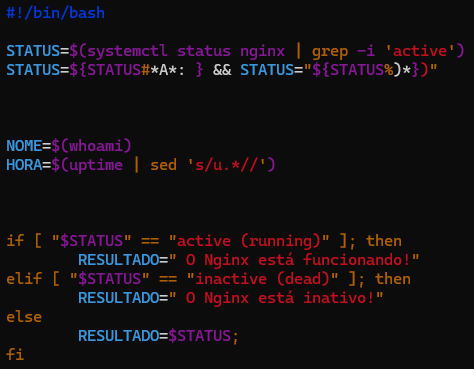 

## 3.4- Parte offline

Agora para passar essa informação para um arquivo, basta utilizar **>> var/log/status.log** e esta informação será levada para o arquivo status.log. Inicialmente cria-se o arquivo, ele deve ter as permissões necessárias para escrita e leitura por todos os usuários.

 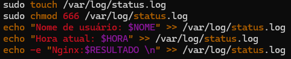 

 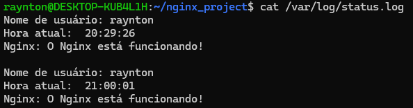 

## 3.5- Parte Online

Para apresentar online essa informação, basta criar um arquivo html, com o nome index.html em /var/www/html e inserir neste arquivo uma página html com as informações desejadas utilizando o **> /var/www/html/index.html** e esta informação será levada para o arquivo **index.html**. Inicialmente cria-se o arquivo, ele deve ter as permissões necessárias para escrita e leitura por todos os usuários.

 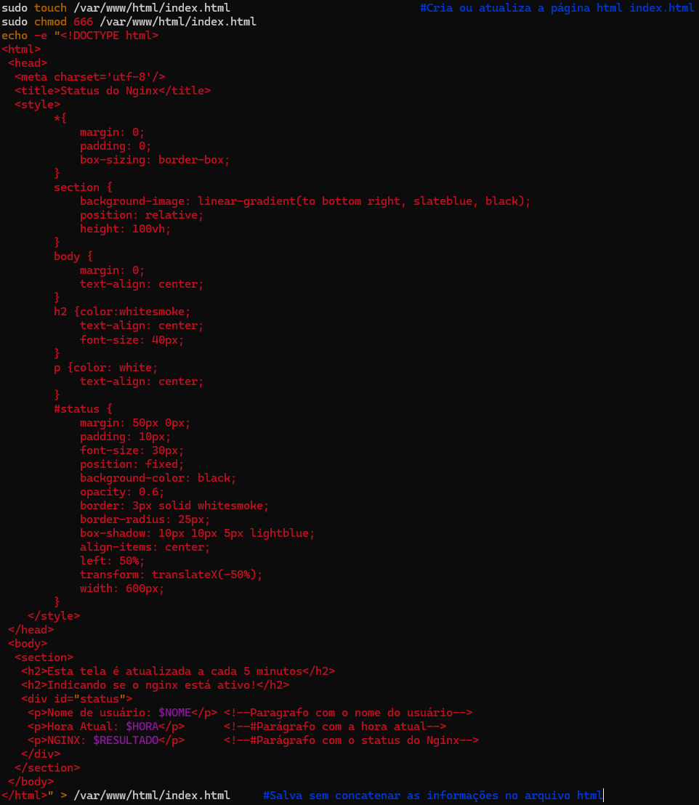 

 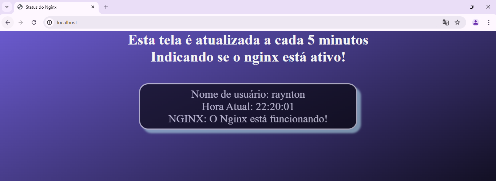 

# 4- Automação

Para que o script rode automaticamente a cada 5 minutos, utiliza-se o **crontab**, seu uso é explicado por Diego R. no artigo <https://www.vivaolinux.com.br/artigo/Como-executar-tarefas-a-cada-5-10-ou-15-minutos>. Com o comando `crontab -e`, é possível editar o arquivo de cronjob do usuário atual. Deve ser informado qual o trabalho que será realizado e em quanto tempo utilizando o seguinte formato:

	Minuto Hora DiaDoMes Mes DiaDaSemana código

Desta forma, caso deseje-se a execução de um script toda hora, no minuto 5, deve-se escrever **5 \* \* \* \* bash script.sh**, mas caso deseje-se a execução a cada 5 minutos, é necessário um \*/ antes do valor, indicando a periodicidade: **\*/5 \* \* \* \* bash script.sh**

Desta forma, para que o script rode a cada 5 minutos, basta indicar seu caminho:

~~~bash
**\*/5 \* \* \* \* bash ~/nginx\_project/scriptNginx.sh**
~~~

 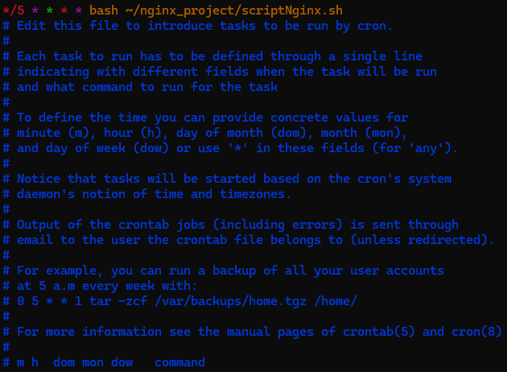 

Agora o comando é executado automaticamente a cada 5 minutos, como pode-se notar no status.log

 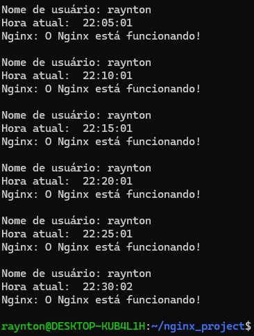 

# 5- Versionamento (GIT)

Para gerenciar e documentar o projeto, utiliza-se do git junto ao github. Instala-se o git e informa o nome de usuário e o email para suas configurações. Será utilizada uma chave ssh para conectar o terminal ao github, deve-se gerar a chave, onde é gerada uma chave pública e uma chave privada.

~~~bash
apt-get update
apt-get install git
git config --global user.name "name"
git config --global user.email "email@domain.com"
ssh-keygen -t ed25519 -C "email@domain.com"
chmod 600 ~/.ssh/id_ed25519
ssh-add ~/.ssh/id_ed25519
~~~

No github, em **settings** -> **SSH and GPG keys**, adiciona-se a chave publica que estará no diretório **.ssh/id_ed25519.pub**. Para adicionar a chave, basta clicar em **New SSH Key** e inserir a chave, sem o email. Após esse processo, conecta-se ao github com o comando

~~~bash
ssh -T git@github.com
~~~

Após a conexão estabelecida, basta clonar o repositório a partir da chave ssh. 

~~~bash
git clone git@github.com:User/project
~~~

Com o git devidamente clonado, o projeto deve estar na pasta do projeto e este deve estar sendo observado pelo git, com o uso do:

~~~bash
git init
~~~

Para subir alterações, deve-se primeiramente adicionar o arquivo aos supervisionados, depois commitar indicando uma mensagem informativa sobre a alteração e depois subir a alteração.

~~~bash
git add arquivo.extensão
git commit -m "Mensagem do commit"
git push
~~~

Caso sejam realizadas alterações pelo github, para ter essas alterações na máquina local utiliza-se o:

~~~bash
git pull
~~~

# Conclusão

Com este projeto foi possível colocar em prática os conhecimentos de comandos linux junto a criação de um script em bash. Além do aprendizado em sistemas linux, também foi possível aprender sobre o versionamento de código utilizando o git para tal função.
